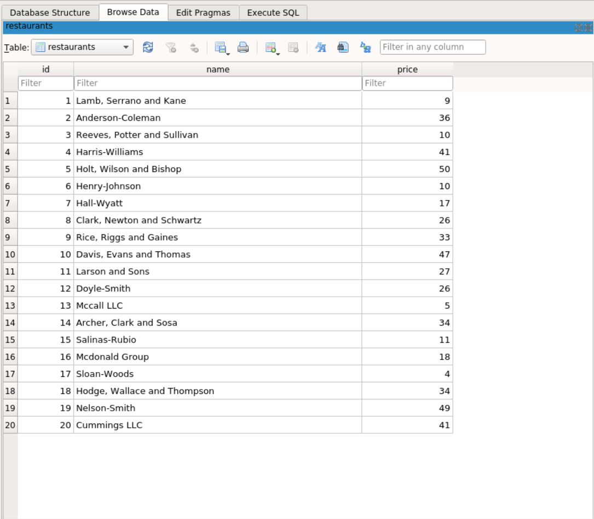
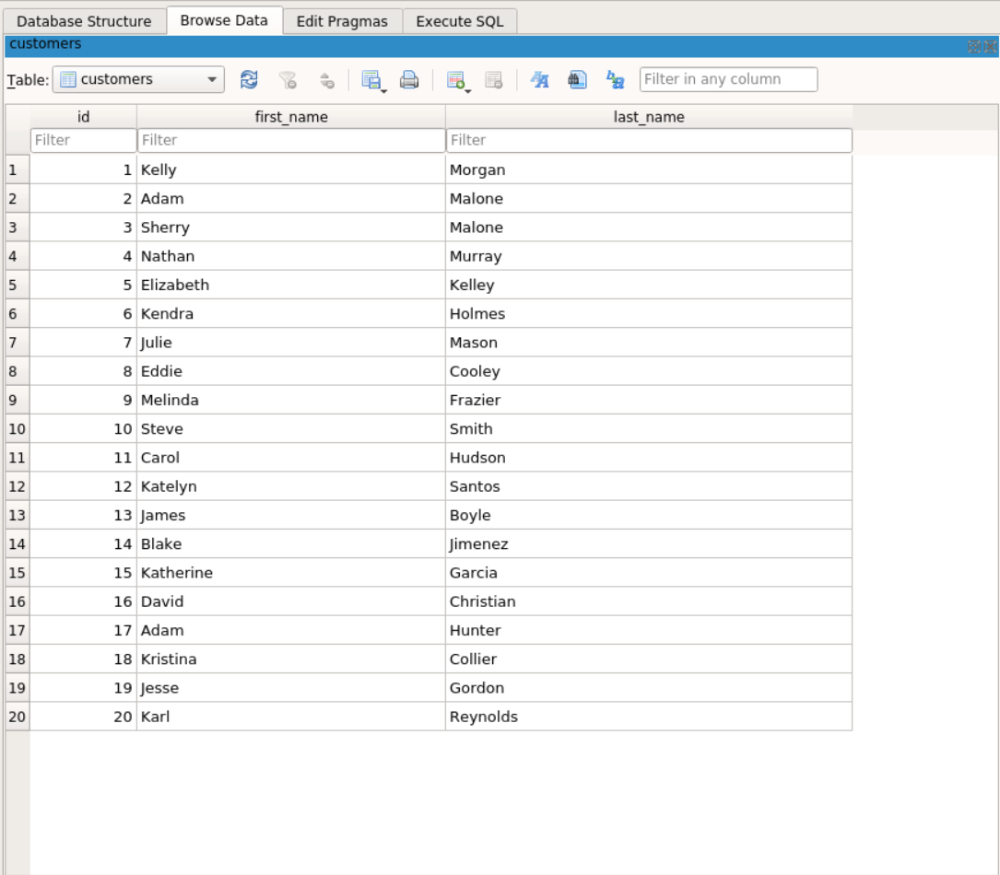
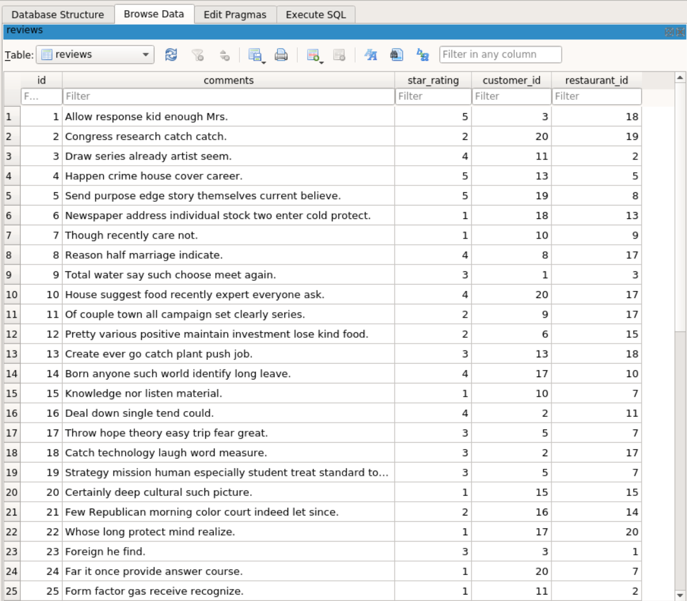

# Python Week 3 - Code Challenge

This project involves three main models in a Yelp-style domain: Restaurant, Customer, and Review. The relationships between these models are defined as follows:

1. A Restaurant has many Reviews.
2. A Customer has many Reviews.
3. A Review belongs to both a Customer and a Restaurant.
4. The relationship between Restaurant and Customer forms a many-to-many relationship.

## Project Setup

1. Create a new project folder.
2. Create a new GitHub repository
3. Please make sure you regularly commit to the repository.
4. Ensure to add a READEME.md file
5. Add a License file, preferrably the MIT license
6. Ensure to organize your python solution in a lib folder

NOTE: To run the test suites for this project, run:

                python lib/testing.py

when in the `pipenv shell`

## `DELIVERABLE 1 - Migrations`

Before buidling out our methods, we need to create 3 tables for the reviews, restaurants and customers. 

NOTE: I have created a seed file which populates the tables we will create with random data and below are images of the tables through the DB Browser Interface 

### __restaurants__



### __customers__



### __reviews__



To establish the necessary relationships and create the required columns for the reviews table, a migration script needs to be executed. The Review table should have foreign key columns for customer_id and restaurant_id to associate each review with a customer and a restaurant. Additionally, there should be a star_rating column to store the integer value representing the rating for a review.

Ensure that you install the alembic library which will handle migrations in our code:

                pip install alembic

This will create several file and within this files, alembic.ini and env.py contain important settings that need to be changed to work with our database and SQLAlchemy app specifically.
alembic.ini contains a sqlalchemy.url setting on line 58 that points to the project database. Since we're starting to make changes to existing databases, we're going to use a .db file instead of working in memory:

                sqlalchemy.url = sqlite:///migrations_test.db

Next create a models.py file and navigate into it and start designing our database:

```python

# imports from sqlalchemy
from sqlalchemy import create_engine, func
from sqlalchemy import Column, Integer, String, ForeignKey
from sqlalchemy.orm import relationship
from sqlalchemy.orm import sessionmaker
from sqlalchemy.ext.declarative import declarative_base
from sqlalchemy.ext.associationproxy import association_proxy

# this is the base class
Base = declarative_base()

```

Next, we need to configure env.py to point to the metadata attribute of our new declarative_base object. Alembic will use this metadata to compare the structure of the database schema to the models as they are defined in SQLAlchemy. Now, let's update migrations/env.py:

```python

# migrations/env.py
# search file for target_metadata (line 21)
from models import Base
target_metadata = Base.metadata

```

To make the first migration run the following commands in the terminal:

```terminal

# 1
pipenv install && pipenv shell

#2
alembic revision -m "Empty Init"

#3
alembic upgrade head

```

After addition of data to our model.py, we run the autogenerate migration code and then updgrade our head. This will be done anytime we want to make a new migration

                alembic revision --autogenerate -m "Added new model"


### Standard Model

This explains the standard model of the 3 tables i have created using the Restaurant class as an example:

```python

class Restaurant(Base):
    # this houses the table name 
    __tablename__ = "restaurants"
    
    # These are the columns for that table
    id = Column(Integer, primary_key=True)
    name = Column(String(250))
    price = Column(Integer())
    
    # relationship link
    reviews = relationship("Review", back_populates="restaurant")
    customers = association_proxy('reviews', 'customer',
        creator=lambda cs: Review(customer = cs))

    # string representation
    def __repr__(self):

        return f'Restaurant(id={self.id}, ' + \
            f'name={self.name}, ' + \
            f'price={self.price})'

```

The provided code defines the Restaurant class, representing the model for restaurant entities in the database. Below is a breakdown of each section:

#### Class Declaration and Table Name

``` python

class Restaurant(Base):
    __tablename__ = "restaurants"

```
The Restaurant class is declared, inheriting from the Base class, which is part of the SQLAlchemy ORM (Object-Relational Mapping) framework.
`__tablename__` specifies the name of the table associated with this class in the database, which is set to "restaurants."

#### Table Columns

``` python

id = Column(Integer, primary_key=True)
name = Column(String(250))
price = Column(Integer())

```

The class defines three columns for the "restaurants" table:
1. id: An integer column serving as the primary key for unique identification.
2. name: A string column with a maximum length of 250 characters, storing the name of the restaurant.
3. price: An integer column representing the price of the restaurant.

#### Relationship Links

```python

reviews = relationship("Review", back_populates="restaurant")
customers = association_proxy('reviews', 'customer',
    creator=lambda cs: Review(customer = cs))

```

The relationship function establishes a link between the Restaurant class and the Review class, indicating a one-to-many relationship. It signifies that a restaurant can have multiple reviews associated with it.

The association_proxy creates a proxy attribute customers that allows direct access to the customers who have reviewed the restaurant.

#### String Representation

```python

def __repr__(self):
    return f'Restaurant(id={self.id}, name={self.name}, price={self.price})'

```

The `__repr__` method provides a string representation of a Restaurant object. It returns a formatted string containing the restaurant's id, name, and price attributes. This representation is useful for debugging and logging.

### Relationship Links Between Tables

To ensure that my tables have a many to many relationship we have to first link the reviews to customers and restaurants through a one to many relationship and then use an `association_proxy` (imported from `sqlalchemy.ext.associationproxy`) to refer to the many-to-many related table. 

Within the reviews table:

#### Foreign Keys

```python

customer_id = Column(Integer, ForeignKey("customers.id"))
restaurant_id = Column(Integer, ForeignKey("restaurants.id"))

```

Two foreign key columns (customer_id and restaurant_id) are defined in the Review class. These columns establish a link between the Review table and the Customer and Restaurant tables, respectively.

The ForeignKey function is used to create a foreign key constraint, ensuring that the values in these columns correspond to the primary keys of the referenced tables ("customers.id" and "restaurants.id").

#### Relationship Links

```python

customer = relationship("Customer", back_populates="reviews")
restaurant = relationship("Restaurant", back_populates="reviews")

```

The relationship function establishes a bidirectional relationship between the Review class and the Customer and Restaurant classes. This relationship is based on the foreign key columns defined earlier.

The "Customer" and "Restaurant" arguments indicate the target classes of the relationships.

The back_populates parameter ensures that changes made on one side of the relationship are automatically reflected on the other side. In this case, it connects the reviews attribute in the Customer and Restaurant classes to the customer and restaurant attributes in the Review class, respectively.


## `DELIVERABLE 2 - Object Relationship Methods`

The provided documentation outlines a set of methods to be implemented for managing object relationships within the Yelp-style domain, specifically focusing on the Review, Restaurant, and Customer classes using SQLAlchemy query methods. 

For the Review class, the find_customer() method aims to retrieve the associated Customer instance, and the find_restaurant() method is designed to fetch the linked Restaurant instance. 

```python

    # find the customer associated with the review
    def find_customer(self):
        return self.customer
    
    # find the restaurant associated with the review
    def find_restaurant(self):
        return self.restaurant

```

The Restaurant class includes find_reviews_on_restaurant(), which returns all reviews for the current restaurant, and find_customers(), which provides a collection of customers who have reviewed the restaurant. 

```python

    # find the reviews on this restaurant
    def find_reviews_on_restaurant(self):
        return self.reviews
    
    # find the customers who reviewed this restaurant
    def find_customers(self):
        return [review.customer for review in self.reviews]

```

Finally, the Customer class contains find_reviews_by_customer(), returning all reviews by the customer, and find_restaurants(), which gives a collection of restaurants reviewed by the customer. These methods leverage the power of SQLAlchemy query methods to establish and navigate relationships effectively.

```python

    # find the reviews associated with the customer
    def find_reviews_by_customer(self):
        return self.reviews
    
    # find the restaurants associated with the customer
    def find_restaurants(self):
        return [review.restaurant for review in self.reviews]


```

## `DELIVERABLE 3 - Aggregate and Relationship Methods`

The specified methods contribute to the Yelp-style domain's functionality, focusing on aggregate and relationship features within the Customer, Review, and Restaurant classes. For the Customer class, the full_name() method concatenates the first and last names to provide the Western-style full name of the customer. 

```python

    # return the full name
    def full_name(self):
        return f"{self.first_name} {self.last_name}"

```

The favorite_restaurant() method returns the restaurant instance with the highest star rating, showcasing the customer's preferred dining choice. 

```python

    # find the favorite restaurant based on how high the rating is
    def favorite_restaurant(self, session):
        favorite_restaurant = (
            session.query(Restaurant)
            .join(Review, Restaurant.id == Review.restaurant_id)
            .filter(Review.customer_id == self.id)
            .order_by(Review.star_rating.desc())
            .first()
        )
        return favorite_restaurant

```

The add_review(restaurant, rating) method enables the addition of new reviews, associating them with the specified restaurant and rating. 
Conversely, the delete_reviews(restaurant) method allows the removal of all customer reviews for a given restaurant, necessitating the deletion of corresponding entries in the reviews table.

```python

    # add a review
    def add_review(self, session, restaurant, rating, comments=""):
        new_review = Review(
            customer=self,
            restaurant=restaurant,
            star_rating=rating,
            comments=comments
        )
        session.add(new_review)
        session.commit()

    # delete all the reviews by a customer
    def delete_reviews(self, session, restaurant):
        reviews_to_delete = session.query(Review).filter(
            Review.customer_id == self.id,
            Review.restaurant_id == restaurant.id
        ).all()

        for review in reviews_to_delete:
            session.delete(review)

        session.commit()

```

The Review class introduces the full_review() method, which formats a string encapsulating essential review details, including the restaurant name, customer's full name, and star rating. 

```python

    # Output a full review
    def full_review(self):
        return f"Review for {self.restaurant.name} by {self.customer.full_name()}: {self.star_rating} stars."

```

On the other hand, the Restaurant class includes a class method, fanciest(), which identifies and returns the restaurant instance with the highest price, signifying the most upscale dining option. 

```python

    # find the fanciest restaurant based on the highest price
    @classmethod
    def fanciest(cls, session):
        fanciest_restaurant = (
            session.query(cls)
            .order_by(cls.price.desc())
            .first()
        )
        return fanciest_restaurant

```

The all_reviews() method within the Restaurant class produces a list of strings, each containing a review for the specific restaurant. Together, these methods enhance the application's capability to manage and present aggregate information about customers, reviews, and restaurants within the Yelp-style domain.

```python

    # find all the reviews for this restaurant
    def all_reviews(self, session):
        reviews = session.query(Review).filter(Review.restaurant_id == self.id).all()
        formatted_reviews = [
            f"Review for {self.name} by {review.customer.full_name()}: {review.star_rating} stars."
            for review in reviews
        ]
        return formatted_reviews

```